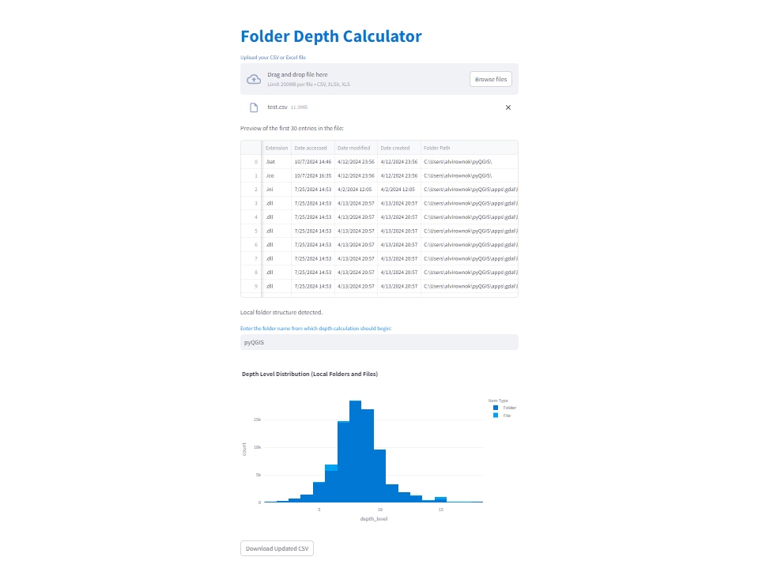

# OneDrive-Depth-Analytics

**OneDrive-Depth-Analytics** is a Python-based application designed to calculate folder depths from CSV or Excel files containing folder structures. The tool can handle both local file systems and OneDrive paths, allowing users to specify a folder name from which the depth calculation will start.

The application is built using `Streamlit` for the user interface and `Plotly` for interactive data visualizations. Users can upload CSV or Excel files, specify the folder of interest, and view visualizations of the folder depth distribution.

## Features

- **CSV and Excel File Support**: The app can process both CSV files (with comma or semicolon delimiters) and Excel files.
- **Local and OneDrive Folder Structures**: The app automatically detects whether the file contains local folder paths or OneDrive folder paths.
- **Custom Depth Calculation**: Users can specify a folder name, and the depth calculation will be performed starting from that folder.
- **Interactive Visualizations**: Visualizations are generated using Plotly, providing an interactive experience.
- **Download Functionality**: Users can download the updated CSV file with calculated depth levels and the generated plots.

## How It Works

1. **Upload Your File**: Users upload a CSV or Excel file containing folder paths. The app will automatically detect the file type and process it accordingly.
2. **Preview the Data**: The app displays a preview of the first 30 rows from the uploaded file.
3. **Select Folder**: Users can specify a folder name from which depth calculation should start. The depth of folders and files will be calculated starting from the specified folder in the path.
4. **View Interactive Plots**: The depth distribution is visualized using Plotly charts. These plots allow for interactivity, such as zooming and hovering over data points.
5. **Download Updated Files**: Users can download the updated CSV file with calculated depth levels and the visualized plots.

### User-Interface

Here is our UI:



## Installation

### Prerequisites

- **Python 3.7+** installed on your machine.
- The following Python packages should be installed:

  ```bash
  pandas
  streamlit
  plotly
  kaleido
  ```

### Setup Instructions

1. **Clone the repository**:
   ```bash
   git clone https://github.com/yourusername/OneDrive-Depth-Analytics.git
   ```

2. **Navigate to the project directory**:
   ```bash
   cd OneDrive-Depth-Analytics
   ```

3. **Install dependencies**:
   If you're using `pip`, run:
   ```bash
   pip install -r requirements.txt
   ```

   Alternatively, if you're using `Poetry`:
   ```bash
   poetry install
   ```

4. **Run the application locally**:
   Start the Streamlit app by running the following command:
   ```bash
   streamlit run onedrive_depth_analysis_fabritech.py
   ```

   This will start a local server, and you can view the app in your browser.

## Usage

1. **Upload Your File**:
   - You can upload either a CSV or Excel file containing folder paths.
   - For CSV files, the delimiter can be either a comma or a semicolon.

2. **Specify Folder Name**:
   - Enter the folder name from which you want to start the depth calculation.

3. **Interactive Plots**:
   - Visualize folder depth distribution across folder structures using Plotly charts.

4. **Download**:
   - Download the updated CSV file with depth levels.
   - Download the generated plots in PNG format.

## Example

If you upload a CSV file structured like this:

| Folder Path                                           | Date Modified       |
|-------------------------------------------------------|---------------------|
| `C:\Users\yourname\Documents\Projects\Project1\`      | 2024-10-01 12:34    |
| `C:\Users\yourname\Documents\Projects\Project2\`      | 2024-10-02 15:22    |
| `C:\Users\yourname\Downloads\Files\`                  | 2024-10-03 09:17    |

And specify "Documents" as the folder from which to calculate depth, the output will show depth levels based on paths starting from "Documents".

**Live Application:** [onedrive-depth-analytics](https://onedrive-depth-analytics.streamlit.app/)

## License

This project is licensed under the Apache License 2.0. See the [LICENSE](LICENSE) file for details.

## Contributing

Contributions are welcome! Please follow these steps:

1. Fork the repository.
2. Create a new branch (`git checkout -b feature-name`).
3. Commit your changes (`git commit -m 'Add some feature'`).
4. Push to the branch (`git push origin feature-name`).
5. Open a Pull Request.

## Contact

For any inquiries or support, please contact:

- **Alvi Rownok**
- **Email**: alvi2241998@gmail.com
- **LinkedIn**: [alvi-rownok](https://www.linkedin.com/in/alvi-rownok/)
- **GitHub**: [AlviRownok](https://github.com/AlviRownok)

---

© 2024 OneDrive Depth Analytics Platform. All rights reserved.